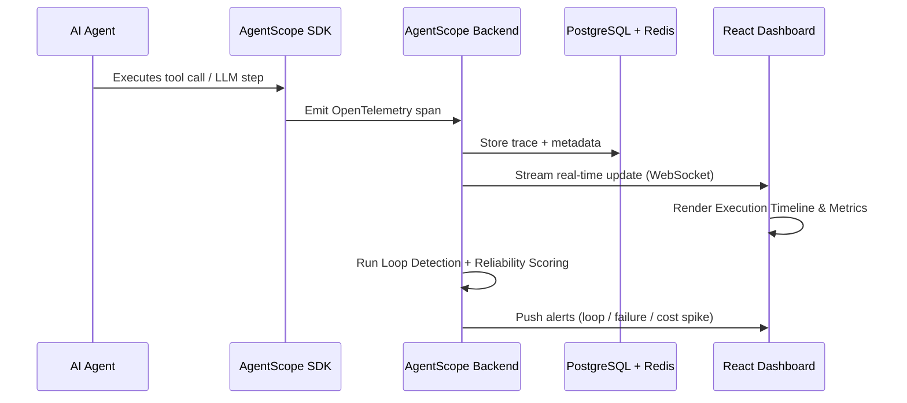

<div align="center">
  

  # AgentScope
  **Chrome DevTools for AI Agents — Observe, Debug, and Optimize your agentic workflows.**

  *Full execution visibility. Real-time failure analysis. Loop detection, cost tracking, and reliability scoring — before a single bug reaches production.*
  <br/>
  **Created by Manthan Dubey**

  [](https://agentscope.vercel.app)
  [](LICENSE)
  [](https://www.python.org/)
  [](https://fastapi.tiangolo.com/)

  <br/>

  
  
  
  
  
  

  <br/>

  **Why I built this:** *AI agents today can plan, call tools, search, remember, and act — but when something breaks, all you get is "Something went wrong." I wanted a platform that gives developers the same debugging rigour we brought to web apps 15 years ago — but for agentic systems.*

  <br/>

  [**Live Demo**](https://agentscope.vercel.app) | [**Quick Start**](#-quick-start) | [**Modules**](#-core-modules) | [**Tech Stack**](#️-tech-stack) | [**Report Bug**](https://github.com/MarutiDubey/AgentScope/issues)

</div>

---

## 📑 Table of Contents

- [🎯 Who Is This For?](#-who-is-this-for)
- [🔥 The Problem](#-the-problem)
- [✨ Features](#-features)
- [🏗️ Architecture](#️-architecture)
- [🔍 Core Modules](#-core-modules)
- [⚡ Quick Start](#-quick-start)
- [🛠️ Tech Stack](#️-tech-stack)
- [🔌 Agent Integrations](#-agent-integrations)
- [⚙️ Configuration](#️-configuration)
- [🧑‍💻 Local Development](#-local-development)
- [🤝 Contributing](#-contributing)
- [📄 License](#-license)
- [👨‍💻 Built By](#-built-by)

---

## 🎯 Who Is This For?

AgentScope is for **developers building and running AI agents in production** who need more than a log file to understand what their agent actually did.

- **AI application developers** — debug failed runs in minutes, not hours.
- **Startups building agentic products** — ship reliable agents with confidence.
- **Enterprise engineering teams** — enforce reliability standards and track cost at scale.
- **AI researchers** — compare agent run behaviour across prompts, models, and configurations.
- **Open-source maintainers** — give contributors clear execution traces for reproducible issues.
- **Students learning agentic workflows** — visualize exactly how agents reason and make decisions.

---

## 🔥 The Problem

Modern AI agents are no longer simple chatbots. A single user request can trigger dozens of chained reasoning steps and tool calls:

```
User → Planner → LLM → Tool Calls (Search / DB / Browser / File / API) → Memory → Decision → Response
```

**Example:** *"Book the cheapest flight next Friday, save it to my calendar, and email me the itinerary."*

The agent might: search flights → compare prices → check preferences → access calendar → create event → generate email → send email.

If **any step fails**, the entire workflow silently breaks — and today, this is all developers see:

```
"I'm sorry. Something went wrong."
```

### Current industry failures

| Problem | What happens |
|---|---|
| **Infinite loops** | `search → search → search → timeout` — API budget burns silently |
| **Hallucinated tool calls** | Agent invents `sendMoney()` — tool not found |
| **Memory errors** | Agent told *"I live in India"* — later responds *"since you live in Canada…"* |
| **Repeated API calls** | 4 identical `Weather API` requests in one run — latency spikes, cost climbs |
| **Token cost explosions** | A $0.02 task costs $0.80 because the agent re-sends full context on every retry |
| **Unpredictable behaviour** | Same prompt, different execution path on every run — production systems can't be trusted |

> **Existing "solutions"** — console logs, raw JSON traces, manual debugging — break down the moment an agent makes more than 5 decisions.

**There is no unified platform that gives developers complete visual visibility into AI agent execution.** AgentScope fills that gap.

🚀 Built AgentScope — "Chrome DevTools for AI Agents"

AI agents today can plan, call tools, search, remember, and act — but when something breaks, all you usually get is:

"Something went wrong."

No idea which step failed. Which tool errored out. Whether the agent hallucinated a tool call. Whether it got stuck in a loop hammering the same API 5 times in a row while your token bill quietly climbs.

So I built AgentScope — an observability and debugging platform that gives developers full visibility into how their AI agents actually execute, not just what they output.

🔍 What it does:

→ Execution Timeline — visualize every reasoning step, tool call, and decision the agent makes, in order
→ Tool Monitor — track latency, failures, retries, and duplicate calls per tool
→ Memory Inspector — see exactly when the agent reads/writes memory (and catch stale or contradictory context before it causes weird outputs)
→ Cost Dashboard — break down input/output tokens and cost per run, so you can actually find your expensive workflows
→ Loop Detection — catch infinite search-search-search patterns before they burn your API budget
→ Reliability Report — a single score per run (with failures, retries, latency, cost) so you can compare agent runs at a glance

🛠️ Stack: FastAPI/Node.js backend with OpenTelemetry for tracing, PostgreSQL + Redis, React/Next.js frontend with Tailwind and React Flow/D3.js for the execution graphs — designed to plug into LangGraph, CrewAI, AutoGen, and MCP-compatible agents.

Why this matters: as agents move from single LLM calls to dozens of chained tool calls and decisions, "it failed somewhere" is not good enough for production. Debugging agentic systems needs the same rigor we brought to debugging web apps 15 years ago.


Built by Manthan Dubey
📧 dubeymanthan007@gmail.com
🔗 [linkedin.com/in/manthandubey](https://www.linkedin.com/in/manthandubey)

#AIAgents #LLM #DeveloperTools #Observability #AgentOps #BuildInPublic #OpenSource #AI
---

## ✨ Features

- 🗂️ **Execution Timeline** — visualize every reasoning step, tool call, and decision in chronological order.
- 🔧 **Tool Monitor** — track latency, failures, retries, and duplicate calls per tool across every run.
- 🧠 **Memory Inspector** — see exactly when the agent reads or writes memory and catch stale or contradictory context before it causes weird outputs.
- 💰 **Cost Dashboard** — break down input/output tokens and cost per run to find your expensive workflows.
- 🔁 **Loop Detection** — catch `search → search → search` infinite patterns before they burn your API budget.
- 📊 **Reliability Report** — a single score per run (failures, retries, latency, cost) so you can compare agent runs at a glance.
- 🔌 **Drop-in Integration** — plug into LangGraph, CrewAI, AutoGen, and any MCP-compatible agent with minimal setup.
- 📡 **OpenTelemetry Tracing** — industry-standard distributed tracing built in from day one.

---

## 🏗️ Architecture

AgentScope instruments your agent at the framework level using OpenTelemetry. Every tool call, memory access, and LLM invocation emits a trace span. These spans are collected by the AgentScope backend, stored in PostgreSQL (with Redis for real-time streaming), and surfaced through a React/Next.js dashboard with execution graphs powered by React Flow and D3.js.



### Data flow per agent run

```
Agent Start
    ↓
Planner Step  ──────────────┐
    ↓                       │
Tool Call (Search · 320ms)  │  OpenTelemetry Spans
    ↓                       │
Memory Read / Write ────────┘
    ↓
LLM Inference
    ↓
Decision + Response
    ↓
AgentScope → Reliability Score  92/100
```

---

## 🔍 Core Modules

### 1 · Execution Timeline

Visualize every step of an agent run in order — from the initial prompt through every tool call, memory operation, and LLM decision to the final output. Color-coded by status (success / warning / failure), with latency and token counts inline.

```
Start → Prompt → Planner → Search (320ms ✓) → Memory Load → LLM → Browser → Email → Success
```

### 2 · Tool Monitor

Track per-tool statistics across a run and across all runs:

| Metric | Description |
|---|---|
| **Execution time** | P50 / P95 / P99 latency per tool |
| **Failure rate** | Error count and error type breakdown |
| **Retry count** | How many times a tool was retried per run |
| **Duplicate calls** | Identical inputs fired more than once in the same run |

### 3 · Memory Inspector

See the full memory lifecycle for each agent run:

```
Memory
  ↓
Stored  (key: "user_location", value: "India")
  ↓
Updated (key: "flight_options", value: [...])
  ↓
Retrieved (key: "user_location" → "India")
```

Contradictory or stale memory reads are highlighted automatically.

### 4 · Cost Dashboard

Break down token usage and cost at every level:

| Level | Tracked |
|---|---|
| **Per step** | Input tokens, output tokens, model, cost |
| **Per run** | Total tokens, total cost, cost vs. baseline |
| **Per tool** | Token overhead per tool invocation |
| **Cross-run** | Cost trends, regressions, savings opportunities |

### 5 · Loop Detection

AgentScope pattern-matches execution traces in real time and fires an alert the moment it detects a repetitive cycle:

```
search → search → search → search
⚠️  Loop detected: "search" called 4× with identical inputs. Run flagged.
```

Configurable thresholds — set your own repetition limit before an alert is raised.

### 6 · Reliability Report

After every run, AgentScope generates a structured summary:

```
Reliability Score   92 / 100
─────────────────────────────
Failures            1
Retries             2
Total Latency       3.4 sec
Total Cost          $0.19
Tools Used          5
Memory Reads        8
Loop Detected       No
```

Compare scores across runs to spot regressions before they reach users.

---

## ⚡ Quick Start

### Option A · SDK Integration (Python)

```bash
pip install agentscope-sdk
```

```python
from agentscope import instrument

# Wrap your agent at startup — zero code changes to agent logic required
instrument(
    agent_name="my-agent",
    agentscope_endpoint="http://localhost:8000",
    api_key="as_your_api_key",
)

# Your existing LangGraph / CrewAI / AutoGen agent code runs unchanged
```

AgentScope auto-detects the framework (LangGraph, CrewAI, AutoGen) and patches the appropriate hooks.

### Option B · OpenTelemetry Collector

If you already emit OTLP traces, point your collector at AgentScope:

```yaml
# otel-collector-config.yaml
exporters:
  otlp/agentscope:
    endpoint: "http://localhost:4317"   # AgentScope OTLP receiver
    headers:
      x-agentscope-key: "as_your_api_key"

service:
  pipelines:
    traces:
      exporters: [otlp/agentscope]
```

> [!NOTE]
> No SDK required for Option B. Any OTLP-compatible agent or framework works out of the box.

### Option C · Docker Compose (self-hosted, 2 minutes)

```bash
git clone https://github.com/MarutiDubey/AgentScope.git
cd AgentScope
cp .env.example .env        # fill in your secrets
docker compose up -d
```

Open **http://localhost:3000** — the dashboard is live.

---

## 🛠️ Tech Stack

| Layer | Tools |
|---|---|
| **Backend** | Python 3.11+ (FastAPI) or Node.js |
| **Tracing** | OpenTelemetry (OTLP receiver + span processor) |
| **Storage** | PostgreSQL (persistent traces), Redis (real-time streaming) |
| **Frontend** | React + Next.js + Tailwind CSS |
| **Execution Graphs** | React Flow + D3.js |
| **Auth** | JWT + API keys |
| **Deployment** | Docker Compose, Vercel (frontend + API), Railway (backend) |

---

## 🔌 Agent Integrations

AgentScope ships with first-class adapters for the most popular agentic frameworks:

| Framework | Integration | Status |
|---|---|---|
| **LangGraph** | Auto-instrumented via `langchain` callback hooks | ✅ Supported |
| **CrewAI** | Auto-instrumented via CrewAI event listeners | ✅ Supported |
| **AutoGen** | Auto-instrumented via AutoGen middleware | ✅ Supported |
| **OpenAI Agents SDK** | Native OTLP spans + tool call interception | ✅ Supported |
| **MCP-compatible agents** | Any agent emitting MCP tool calls is captured | ✅ Supported |
| **Custom agents** | Use the AgentScope Python SDK to emit spans manually | ✅ Supported |

---

## ⚙️ Configuration

Drop an `agentscope.toml` at your project root:

```toml
[agent]
name = "my-production-agent"          # Display name in the dashboard

[tracing]
endpoint = "http://localhost:8000"    # AgentScope backend URL
api_key  = ""                         # Set via AS_API_KEY env var instead

[alerts]
loop_threshold    = 3                 # Fire alert after N identical consecutive tool calls
cost_threshold    = 1.00              # Fire alert when run cost exceeds $X
latency_threshold = 10000             # Fire alert when run latency exceeds Xms

[reliability]
min_score = 80                        # Fail CI check if reliability score drops below this
```

**Precedence** (low → high): built-in defaults → `agentscope.toml` → environment variables.
API keys are **never** read from `agentscope.toml` — always use `AS_API_KEY` in your environment.

### Environment variables

| Variable | Default | Description |
|----------|---------|-------------|
| `AS_API_KEY` | *(required)* | API key for your AgentScope instance |
| `AS_ENDPOINT` | `http://localhost:8000` | AgentScope backend URL |
| `AS_AGENT_NAME` | *(inferred)* | Display name for this agent in the dashboard |
| `DATABASE_URL` | *(required for self-host)* | PostgreSQL connection string |
| `REDIS_URL` | `redis://localhost:6379` | Redis connection string |
| `LOG_LEVEL` | `INFO` | Logging verbosity: `DEBUG` \| `INFO` \| `WARNING` \| `ERROR` |

> [!IMPORTANT]
> **API Security:** API keys are read only from the environment or `.env` (which is git-ignored). They are never stored in `agentscope.toml` or any committed file.

---

## 🧑‍💻 Local Development

### 1 · Clone and set up the backend

```bash
git clone https://github.com/MarutiDubey/AgentScope.git
cd AgentScope

python -m venv .venv
# Windows
.venv\Scripts\activate
# macOS / Linux
source .venv/bin/activate

pip install -r requirements-dev.txt
pip install -e .
```

### 2 · Configure environment

```bash
cp .env.example .env
# Edit .env — fill in DATABASE_URL, REDIS_URL, and any provider keys
```

### 3 · Start the backend

```bash
uvicorn agentscope.api:app --reload --port 8000
```

### 4 · Start the frontend

```bash
cd frontend
npm install
npm run dev       # Next.js dev server at http://localhost:3000
```

### 5 · Run the test suite

```bash
pytest                                              # all tests
pytest -v                                           # verbose output
pytest --cov=agentscope --cov-report=term-missing   # with coverage
pytest -m "not integration"                         # skip integration tests
```

### 6 · Type-check and lint

```bash
mypy agentscope
ruff check agentscope tests
black --check agentscope tests
isort --check-only agentscope tests
```

---

## 🤝 Contributing

Contributions are welcome. Here's how to get involved:

### Reporting bugs

Open an [issue](https://github.com/MarutiDubey/AgentScope/issues) using the **Bug report** template. Include:
- The agent framework and version you're using
- A minimal reproduction (trace JSON or code snippet)
- The full error output (`LOG_LEVEL=DEBUG` for more detail)

### Requesting features

Open an [issue](https://github.com/MarutiDubey/AgentScope/issues) using the **Feature request** template. Describe the use-case, not just the solution.

### Sending a pull request

1. **Fork** the repository and create a branch from `develop` (not `main`):

   ```bash
   git checkout -b feature/your-feature-name develop
   ```

2. **Make your changes.** Keep each PR focused on one thing.

3. **Add or update tests** for any behaviour you change. All tests live in `tests/`.

4. **Ensure the full quality gate passes** locally:

   ```bash
   pre-commit run --all-files
   pytest --cov=agentscope
   mypy agentscope
   ```

5. **Open the PR** against the `develop` branch. Fill in the PR template — especially the *What Changed & Why* section.

### Commit style

Use short imperative subject lines:

```
feat: add CrewAI auto-instrumentation adapter
fix: handle empty span in execution timeline
docs: add OpenTelemetry collector setup guide
test: cover loop detection threshold edge cases
chore: bump FastAPI to 0.115.0
```

### Branch naming

| Type | Pattern |
|------|---------|
| Feature | `feature/short-description` |
| Bug fix | `fix/short-description` |
| Documentation | `docs/short-description` |
| Chore / deps | `chore/short-description` |

---

## 📄 License

This project is open-source and licensed under the **[MIT License](LICENSE)**.

---

## 👨‍💻 Built By

<div align="center">

**Manthan Dubey**

*Debugging agentic systems needs the same rigour we brought to debugging web apps 15 years ago.*

<br/>

Have questions, feedback, or want to collaborate? Feel free to reach out — I respond to every message.

<br/>

[](mailto:dubeymanthan007@gmail.com)
[](https://www.linkedin.com/in/manthandubey)

<br/>

<sub>📬 For professional inquiries, partnerships, or integration support — <a href="mailto:dubeymanthan007@gmail.com">dubeymanthan007@gmail.com</a></sub>

</div>
